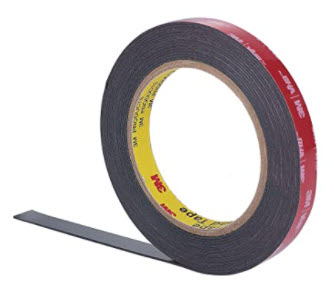
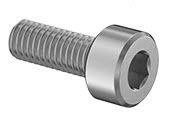
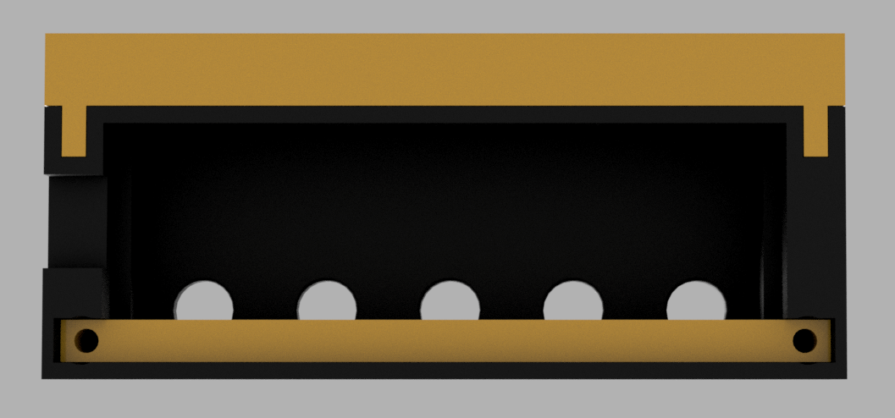
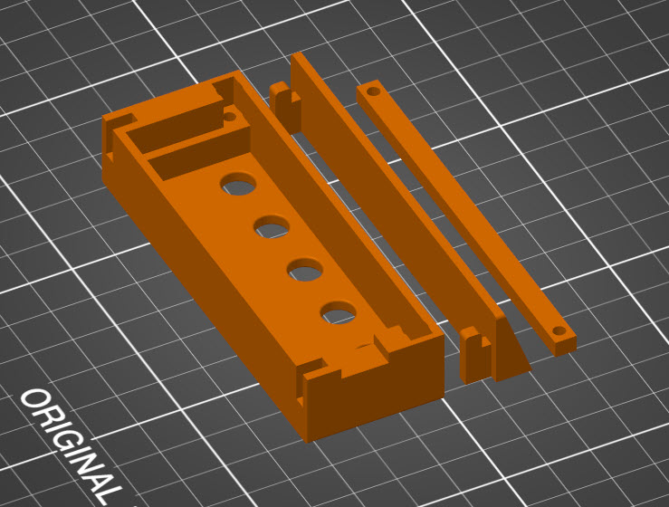

# Super Compact Monitor Mount (SCMM)

## Table of contents

- [Parts and Pieces](#parts-and-pieces)
- [Electronic Assembly](#electronics-assembly)
- [Case](#case)
- [Info about the deej project](#info-about-the-deej-project)

## Parts and Pieces

Teensy is my favorite platform, works very well for keyboards and very full featured for the price. If you want to save some money on the build go with the recommended Arduino Nano, Pro Micro or Uno.
https://www.pjrc.com/store/teensy32.html

Small in size, high in quality.
https://www.digikey.com/en/products/detail/tt-electronics-bi/P110KH-0Y20BR10K/2408865

20 x 80mm, nothing fancy here, always good to have some laying around.
https://www.amazon.com/gp/product/B012YZ2Q3W/ref=ppx_yo_dt_b_search_asin_title?ie=UTF8&psc=1

Right angle micro USB, connect directly into the monitor if supported.
https://www.amazon.com/gp/product/B003YKX6WC/ref=ppx_yo_dt_b_asin_title_o01_s00?ie=UTF8&psc=1

Tape to attach to monitor. 
https://www.amazon.com/gp/product/B07K4SFP4D/ref=ppx_yo_dt_b_search_asin_title?ie=UTF8&psc=1

m3 x 8mm Screw to hold the electronics in the housing.
https://www.mcmaster.com/91292A112/

## Electronics Assembly

SCMM is built on a proto board using 10k potentiometers and a Teensy 3.2 Micro. (SCMM was built with parts I had, I suggest you use the Teensy LC or the Arduino Nano, Pro Micro or Uno if you are ordering new.)

Soild wire used for all connections. There is a bit of assembly order. Make the ground and +3.3v connections (bus) first, then figure out the wiper wires to Teensy AIO pins. Also connect the pots metal housing to ground and solder them all together to increase mechanical structure. If you are using the Teensy LC, you have to use the 3.3v, 5v will kill the board. Teensy 3.2 will be fine with either 3.3 or 5v, for this project I used 3.3v.

## Case

All parts are designed with printing in mind and do not need any support.

The Upper Bracket is attached to the monitor with VHL tape. I used the 3M VBL 5952. The Lower Bracket uses two m3 x 8mm screws to hold the electronics in the housing.

Both the knob and the icons are designed to print two colors using a single filament change.

## Info about the deej project

https://github.com/omriharel/deej

deej is an **open-source hardware volume mixer** for Windows and Linux PCs. It lets you use real-life sliders (like a DJ!) to **seamlessly control the volumes of different apps** (such as your music player, the game you're playing and your voice chat session) without having to stop what you're doing.

**Join the [deej Discord server](https://discord.gg/nf88NJu) if you need help or have any questions!**

