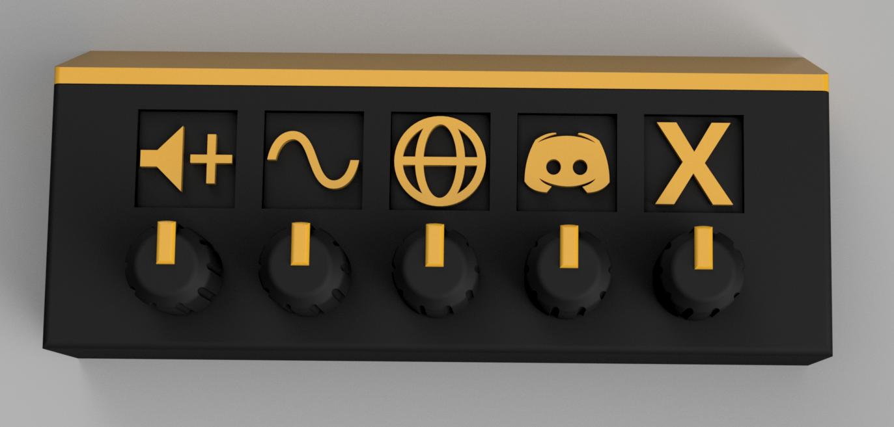
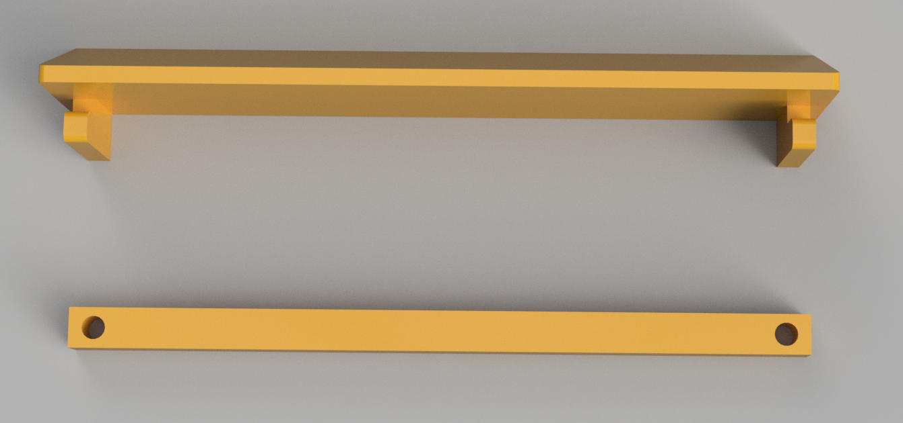

# Super Compact Monitor Mount (SCMM)

## Table of contents

- [Parts and Pieces](#parts-and-pieces)
- [Electronic Assembly](#electronics-assembly)
- [Case](#case)
- [Info about the deej project](#info-about-the-deej-project)

## Parts and Pieces

SCMM is built on a proto board using 10k potentiometers and a Teensy 3.2 Micro. (SCMM was built with parts I had, I suggest you use the Teensy LC if you are ordering new)

https://www.pjrc.com/store/teensy32.html

https://www.digikey.com/en/products/detail/tt-electronics-bi/P110KH-0Y20BR10K/2408865

20 x 80mm 
https://www.amazon.com/gp/product/B012YZ2Q3W/ref=ppx_yo_dt_b_search_asin_title?ie=UTF8&psc=1

Right angle micro USB, connect directly into the monitor if supported.
https://www.amazon.com/gp/product/B003YKX6WC/ref=ppx_yo_dt_b_asin_title_o01_s00?ie=UTF8&psc=1

## Electronics Assembly

Soild wire used for all connections. There is a bit of assembly order. Make the ground and +3.3v connections (bus) first, then figure out the wiper wires to Teensy AIO pins. Also connect the pots metal housing to ground and solder them all together to increase mechanical structure. If you are using the Teensy LC, you have to use the 3.3v, 5v will kill the board. Teensy 3.2 will be fine with either 3.3 or 5v, for this project I used 3.3v.

## Case

## Info about the deej project

deej is an **open-source hardware volume mixer** for Windows and Linux PCs. It lets you use real-life sliders (like a DJ!) to **seamlessly control the volumes of different apps** (such as your music player, the game you're playing and your voice chat session) without having to stop what you're doing.

**Join the [deej Discord server](https://discord.gg/nf88NJu) if you need help or have any questions!**

deej consists of a [lightweight desktop client](#features) written in Go, and an Arduino-based hardware setup that's simple and cheap to build. [**Check out some versions built by members of our community!**](./community.md)

**[Download the latest release](https://github.com/omriharel/deej/releases/latest) | [Video demonstration](https://youtu.be/VoByJ4USMr8) | [Build video by Tech Always](https://youtu.be/x2yXbFiiAeI)**
